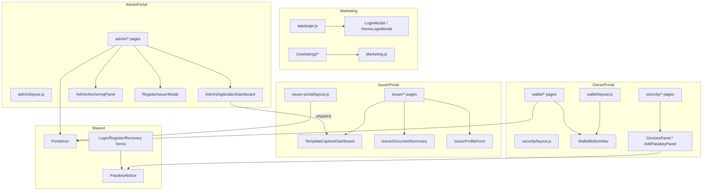

# Signatura Portal Dependency Review

**Repository:** `signaturavaultv1`  
**Review type:** Read-only dependency and boundary analysis  
**Scope:** `src/app/**`, `src/components/**`, layouts, and cross-portal imports  
**Date:** 2026-06-10

---

## Executive Summary

The repository has four conceptual surfaces (Marketing, Issuer Portal, Signatura Owner Portal, System Admin), but portal boundaries are not enforced at the component or route level.

| Check | Count | Status |
|-------|-------|--------|
| Admin pages directly importing issuer components | 0 | OK |
| Admin pages indirectly importing issuer components | 1 | Violation |
| Admin pages importing owner components | 0 | OK |
| Issuer pages importing admin components | 0 | OK |
| Import circular dependencies (compile-time) | 0 | OK |
| Shared components with hardcoded portal APIs | 15+ | High risk |
| Layout structural duplication | 2 major pairs | Tech debt |
| Route-level portal splits | 2 | Architecture debt |

**Primary risks:**

1. `AdminDigitizationDashboard` → `TemplateCaptureDashboard` (admin depends on issuer-named UI).
2. Owner portal split across `/wallet/*` and `/security/*` with separate layouts.
3. Issuer portal split across `/issuer/*` (pages) and `/issuer-portal/*` (layout + re-exports).
4. Flat `src/components/` namespace mixes portal-specific and shared components.

---

## 1. Dependency Map (Overview)



---

## 2. Cross-Portal Import Findings

### 2.1 Admin pages → Issuer components

| Severity | Source | Import chain | Issuer component |
|----------|--------|--------------|------------------|
| **Indirect (transitive)** | `admin/digitization/page.js` | Page → `AdminDigitizationDashboard` → `TemplateCaptureDashboard` | `TemplateCaptureDashboard` |
| **None (direct)** | All other `admin/*` pages | — | No direct `Issuer*` imports |

**Details:**

- `admin/digitization/page.js` only imports `AdminDigitizationDashboard`.
- `AdminDigitizationDashboard.js` imports `TemplateCaptureDashboard`, which defaults to `apiBase='/api/issuer/templates'`.
- Admin usage overrides API via props (`apiBase="/api/admin/templates"`, `canPublish={false}`, etc.), but the component remains issuer-branded and issuer-defaulted.

| Metric | Value |
|--------|-------|
| Admin pages importing issuer components **directly** | 0 |
| Admin pages importing issuer components **transitively** | 1 (`digitization`) |

---

### 2.2 Admin pages → Signatura Owner components

| Check | Result |
|-------|--------|
| Direct imports of `Wallet*`, `DevicesPanel`, `AddPasskeyPanel`, `RecoveryCodesPanel`, `SecurityNavLinks`, `RegisterTrustedDevicePrompt` | None |
| Transitive imports through admin components | None |

**Admin pages importing owner components:** 0

---

### 2.3 Issuer pages → Admin components

| Check | Result |
|-------|--------|
| Direct imports of `Admin*` components in `issuer/*` | None |
| `issuer/templates/page.js` | Imports `TemplateCaptureDashboard` only (shared/issuer, not admin) |

**Issuer pages importing admin components:** 0

**Reverse coupling (issuer uses admin-touched shared UI):**

| File | Shared component | Also used by |
|------|------------------|--------------|
| `issuer/templates/page.js` | `TemplateCaptureDashboard` | Admin digitization (via `AdminDigitizationDashboard`) |

This is a **shared-kernel leak**: one UI component serves both portals with different API bases.

---

### 2.4 Shared components → portal-specific services

Components that **hardcode or default** portal-specific routes/APIs:

| Component | Portal bias | Hardcoded / default targets |
|-----------|-------------|------------------------------|
| `TemplateCaptureDashboard` | Issuer (default) | `apiBase = '/api/issuer/templates'` |
| `IssuerDocumentSummary` | Issuer | `GET /api/issuer/documents` |
| `IssuerProfileForm` | Issuer | `GET/PUT /api/issuer/profile` |
| `IssuerTemplateIssuancePanel` | Issuer | `GET /api/issuer/templates` |
| `IssuerInvitationForm` | Issuer | `POST /api/issuer-invitations` |
| `IssuerActivationForm` | Issuer | `/api/issuer-invitations/activation/*` |
| `AdminAnchoringPanel` | Admin | `/api/admin/anchoring/*` |
| `AdminDigitizationDashboard` | Admin | `GET /api/admin/templates`; embeds `TemplateCaptureDashboard` |
| `RegisterIssuerModal` | Admin (usage) | `POST /api/issuers/register`, `POST /api/issuer-invitations` |
| `WalletBottomNav` | Owner | `/wallet/*`, `/security/*` paths |
| `SecurityNavLinks` | Owner | `/security/devices`, `add-device`, etc. |
| `RegisterTrustedDevicePrompt` | Owner | `/wallet`, `/security/add-device`, `/register?setup=device` |
| `DevicesPanel` | Owner | `/api/security/devices` |
| `AddPasskeyPanel` | Owner | `/api/security/*`, links to `/security/devices` |
| `RecoveryCodesPanel` | Owner | `/api/security/recovery-codes` |
| `LoginModal` | Marketing | `/wallet`, `/issuer-portal`, admin session form |
| `LoginPasskeyForm` | Auth | `/register`, `/issuer-portal` device setup links |
| `QrCodeScanner` | Cross-feature | `/hoa-key/remote-unlock`, `/login/remote-approve` |
| `HoaKeySetupForm` | Integration | `/api/hoa-key/setup/enroll` |
| `HoaKeyRemoteUnlockForm` | Integration | `/api/hoa-key/remote-unlock/*` |

**Safe shared components (no portal API/route coupling):**

| Component | Role |
|-----------|------|
| `PortalIcon` | Icon set only |
| `PasskeyNotice` | Static explanatory copy |
| `ServiceWorkerRegister` | PWA registration |
| `Marketing.js` layout primitives | Public marketing only (contains demo role portal links) |

---

### 2.5 Layout reuse across portals

**No layout file is imported by another portal** (Next.js layouts are route-scoped).

| Layout | Path | Portal | Notes |
|--------|------|--------|-------|
| Root | `app/layout.js` | Global | Wraps all portals + marketing |
| Marketing | `(marketing)/layout.js` | Marketing | Uses `PublicMarketingLayout` |
| Admin | `admin/layout.js` | Admin | Sidebar shell |
| Issuer | `issuer-portal/layout.js` | Issuer | Sidebar shell (~copy of admin) |
| Owner | `wallet/layout.js` | Owner | Top nav + `WalletBottomNav` |
| Owner security | `security/layout.js` | Owner | Minimal nav; separate from wallet layout |
| Issuer stub | `issuer/layout.js` | Issuer (orphaned) | Light-theme stub; conflicts with `issuer-portal/layout.js` |

**Structural duplication (copy-paste, not shared import):**

`admin/layout.js` ≈ `issuer-portal/layout.js`

- Fixed left sidebar (`w-72`)
- `PortalIcon` nav items
- Mobile sticky header + horizontal nav
- Sign-out via `/api/auth/session`

**Layout boundary violations:**

| ID | Issue |
|----|-------|
| L-01 | Dual issuer layouts: `issuer/layout.js` (light) vs `issuer-portal/layout.js` (dark) |
| L-02 | Owner split: `wallet/layout.js` and `security/layout.js` serve one portal with different chrome |
| L-03 | Home page (`app/page.js`) bypasses `(marketing)/layout.js` |
| L-04 | `/security/*` does not inherit `wallet/layout.js` |

---

## 3. Unsafe Imports

| ID | Type | From | To | Risk |
|----|------|------|-----|------|
| U-01 | Transitive cross-portal | `AdminDigitizationDashboard` | `TemplateCaptureDashboard` | Admin UI depends on issuer-named component; issuer defaults can leak if props omitted |
| U-02 | Admin orchestrates issuer domain | `RegisterIssuerModal` (used by `admin/issuers`) | `/api/issuers/register`, `/api/issuer-invitations` | Admin drives issuer registration; component in flat `components/` |
| U-03 | Marketing drives portal RBAC | `LoginModal`, `Marketing.js` `RoleAccessPanel` | `/api/auth/session`, `/wallet`, `/issuer-portal`, `/admin` | Public surface encodes portal entry points |
| U-04 | Owner cross-route coupling | `wallet/page.js` | `RegisterTrustedDevicePrompt` | Reinforces `/wallet` + `/security` split |
| U-05 | Multi-feature scanner | `QrCodeScanner` | Hardcoded HOA + login paths | Shared scanner knows multiple route prefixes |

**Not unsafe (expected):**

- All portals importing `PortalIcon`
- Auth forms used by public auth routes only
- `admin/*` importing `AdminAnchoringPanel`, `AdminDigitizationDashboard`, `RegisterIssuerModal`

---

## 4. Circular Dependencies

### 4.1 Module import cycles (compile-time)

**None detected** in `src/components/**` or `src/app/**` page imports.

Verified acyclic chains:

```
AdminDigitizationDashboard → TemplateCaptureDashboard  (no reverse edge)
LoginPasskeyForm → LoginTrustedDeviceQrPanel           (no reverse edge)
HomeLoginModal → LoginModal                            (no reverse edge)
```

### 4.2 Logical / runtime cycles (feature coupling)

| ID | Cycle | Nature |
|----|-------|--------|
| C-01 | Admin digitization ↔ Issuer templates | Same `TemplateCaptureDashboard` + `lib/issuer-templates.js` + parallel APIs |
| C-02 | Admin issuer registry ↔ Issuer onboarding | `RegisterIssuerModal` registers; `IssuerInvitationForm` / `IssuerActivationForm` consume |
| C-03 | Owner wallet ↔ Owner security | `WalletBottomNav` and `wallet/profile` link across `/security/*` |

### 4.3 Duplicate logic (parallel implementations)

| Feature | Implementation A | Implementation B |
|---------|------------------|------------------|
| Issuer invitation UI | `IssuerInvitationForm` (`issuer/onboarding`) | Inline invite modal in `admin/issuers/page.js` |
| Marketing home | `app/page.js` (~580 lines) | `Marketing.js` `MarketingHome` (unused by `/`) |
| Portal sidebar chrome | `admin/layout.js` | `issuer-portal/layout.js` |
| Demo role sign-in | `LoginModal` portal links | `Marketing.js` `RoleAccessPanel` |

---

## 5. Portal Boundary Violations

| ID | Violation | Evidence |
|----|-----------|----------|
| B-01 | Admin UI depends on issuer component | `AdminDigitizationDashboard` → `TemplateCaptureDashboard` |
| B-02 | Single component, two portal APIs | `TemplateCaptureDashboard` defaults to issuer API; admin overrides via props |
| B-03 | Owner portal split across route trees | `wallet/*` + `security/*` with separate layouts |
| B-04 | Issuer portal split across route trees | `issuer/*` pages + `issuer-portal/*` layout/re-exports + `proxy.js` redirect |
| B-05 | Marketing vs owner route name collision | Public `/security` (marketing) vs `/security/devices` (owner) |
| B-06 | Flat `components/` namespace | `Issuer*`, `Wallet*`, `Admin*`, auth, marketing coexist |
| B-07 | Shared lib across admin + issuer APIs | `lib/issuer-templates.js` used by both `/api/admin/templates` and `/api/issuer/templates` |
| B-08 | `ROLE_HOME` hardcodes old prefixes | `lib/roles.js`: `/wallet`, `/issuer-portal`, `/admin` |
| B-09 | Home path resolver tied to wallet | `lib/signaturaHome.js` defaults `fallback = '/wallet'` |

---

## 6. Per-Portal Component Ownership

### Marketing

- `Marketing.js`
- `HomeLoginModal.js`
- `LoginModal.js`
- `ServiceWorkerRegister.js`
- Inline `page.js` helpers (`Icon`, `CheckItem`, `ProblemItem`)

### Issuer Portal

- `IssuerDocumentSummary`
- `IssuerProfileForm`
- `IssuerInvitationForm`
- `IssuerActivationForm`
- `IssuerTemplateIssuancePanel`
- `TemplateCaptureDashboard` *(shared kernel — should not stay issuer-only)*

### Owner Portal (Signatura)

- `WalletBottomNav`
- `WalletIssuerDirectory`
- `WalletIssuerDocuments`
- `RegisterTrustedDevicePrompt`
- `DevicesPanel`
- `AddPasskeyPanel`
- `RecoveryCodesPanel`
- `SecurityNavLinks`

### System Admin

- `AdminAnchoringPanel`
- `AdminDigitizationDashboard`
- `RegisterIssuerModal`

### Auth (pre-portal)

- `LoginPasskeyForm`
- `LoginTrustedDeviceQrPanel`
- `LoginRemoteApproveForm`
- `RegisterPasskeyForm`
- `RecoveryCodeLoginForm`
- `PasskeyNotice`

### Integrations

- `HoaKeySetupForm`
- `HoaKeyRemoteUnlockForm`
- `QrCodeScanner`

### Truly shared

- `PortalIcon`

---

## 7. Page → Component Import Tables

### Admin pages

| Page | Components imported |
|------|---------------------|
| `admin/page.js` | `PortalIcon` |
| `admin/issuers/page.js` | `PortalIcon`, `RegisterIssuerModal` |
| `admin/digitization/page.js` | `AdminDigitizationDashboard` → **`TemplateCaptureDashboard`** |
| `admin/anchoring/page.js` | `AdminAnchoringPanel`, `PortalIcon` |
| `admin/analytics/page.js` | `PortalIcon` |
| `admin/system/page.js` | `PortalIcon` |
| `admin/layout.js` | `PortalIcon` |

### Issuer pages

| Page | Components imported |
|------|---------------------|
| `issuer/page.js` | `IssuerDocumentSummary` |
| `issuer/templates/page.js` | `TemplateCaptureDashboard` |
| `issuer/issuance/page.js` | `IssuerTemplateIssuancePanel` |
| `issuer/profile/page.js` | `IssuerProfileForm` |
| `issuer/onboarding/page.js` | `IssuerInvitationForm` |
| `issuer/activate/page.js` | `IssuerActivationForm` |
| `issuer/digital-documents/page.js` | `PortalIcon` (+ server `prisma`, `issuer-templates`) |

### Owner pages

| Page | Components imported |
|------|---------------------|
| `wallet/page.js` | `PortalIcon`, `RegisterTrustedDevicePrompt` |
| `wallet/layout.js` | `PortalIcon`, `WalletBottomNav` |
| `wallet/issuers/page.js` | `WalletIssuerDirectory` |
| `wallet/issuers/issuer/[issuerId]/page.js` | `WalletIssuerDocuments` |
| `wallet/scan/page.js` | `PortalIcon`, `QrCodeScanner` |
| `security/devices/page.js` | `DevicesPanel` |
| `security/add-device/page.js` | `AddPasskeyPanel` |
| `security/add-passkey/page.js` | `AddPasskeyPanel` |
| `security/recovery-codes/page.js` | `RecoveryCodesPanel` |
| `security/layout.js` | `SecurityNavLinks` |

---

## 8. Recommended Shared Components

| Proposed component | Split from | Purpose |
|--------------------|------------|---------|
| `PortalShellLayout` | `admin/layout.js` + `issuer-portal/layout.js` | Sidebar + mobile header; `navItems`, `title`, `brandSlot` props |
| `PortalNavItem` | Repeated nav markup | Consistent portal navigation |
| `TemplateWorkspace` | `TemplateCaptureDashboard` | API-agnostic editor; inject `apiBase`, `capabilities` |
| `TemplateListPanel` | `TemplateCaptureDashboard` | List/upload pane |
| `DocumentStatusFilters` | `IssuerDocumentSummary` | Reusable status chips/filters |
| `SummaryMetricGrid` | `IssuerDocumentSummary`, `admin/page.js` | Dashboard stat tiles |
| `InviteIssuerFlow` | `RegisterIssuerModal` + admin inline modal + `IssuerInvitationForm` | Single invitation workflow |
| `PasskeyNotice` | *(existing)* | Move to `components/shared/` |
| `PortalIcon` | *(existing)* | Move to `components/shared/` |
| `QrScannerCore` | `QrCodeScanner` | Scanner with callback-based route resolution |
| `AuthFormLayout` | Auth page chrome | Login/register/recovery wrapper |

### Components that should not remain shared as-is

| Component | Action |
|-----------|--------|
| `TemplateCaptureDashboard` | Split into shared workspace + portal wrappers |
| `RegisterIssuerModal` | Move to `components/admin/` |
| `WalletBottomNav` | Move to `components/signatura/`; parameterize base path |
| `LoginModal` | Keep in marketing; remove hardcoded portal paths |

---

## 9. Priority Remediation Order

1. **Split `TemplateCaptureDashboard`** — removes admin→issuer component dependency (U-01, B-01, B-02).
2. **Unify owner routes** — merge `wallet/*` + `security/*` under `/signatura/*` (B-03, C-03).
3. **Collapse `issuer/` + `issuer-portal/`** — single layout; delete re-export shims (B-04).
4. **Extract `PortalShellLayout`** — deduplicate admin/issuer layouts.
5. **Consolidate invitation flows** — merge `RegisterIssuerModal`, admin inline invite, `IssuerInvitationForm`.
6. **Reorganize `components/`** — portal folders + import lint rules.

---

## 10. Related Documents

For route structure, folder layout, and migration plan (separate review), see:

- Architecture separation proposal (conversation review, 2026-06-10)
- `docs/OPENTIMESTAMPS_REVIEW.md`
- `docs/SIGNATURA_ZERO_TRUST_REFACTOR_REPORT.md`
- `docs/ZERO_TRUST_GAP_ANALYSIS.md`

---

*This document is a read-only analysis. No repository code was modified to produce it.*
